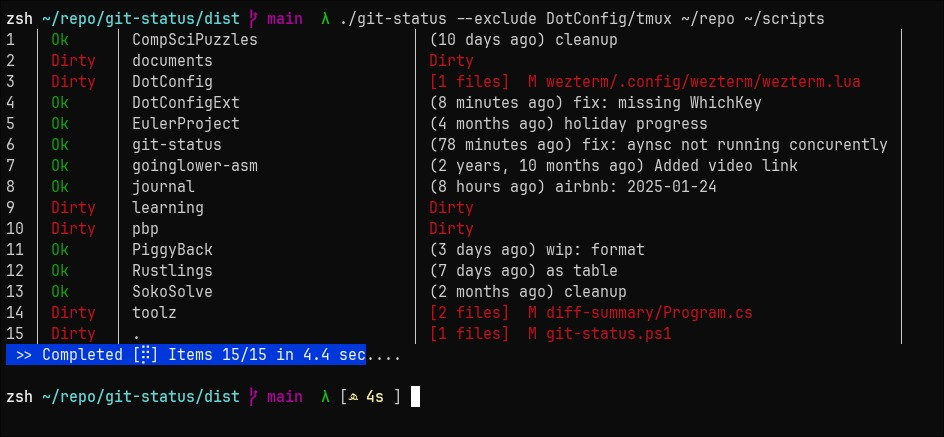

# git-status

> Fast recursive scan for all git repos. Async `git fetch && git status`

`git-status` is a quality-of-life tool to quickly see that status of numerous
project. It is a small/simple help unlike the larger fully-feature `lazygit`.



## Feature List - CLI

- Terminal Rendering
    - [x] Dynamic rendering for table
    - [x] 16-color support
    - [ ] 256-color support
    - [ ] fast rendering (ncurses, etc)
    - [ ] Detect non-interactive then drop colors and dynamic rendering
    - [x] Render a braile-style spinner on global progress line
- Git commands
    - [x] `git fetch`
    - [x] `git pull` only if behind and not dirty
    - [ ] `git remote` icons for github, etc
- [ ] Export to json
- [ ] Async scan phase
- [ ] Create a detailed markdown report will all git output
    - [ ] Open report in browser?
- [x] `--exclude path,path,path`
- [x] `--help` text and man-style doc file
- [ ] Support shell command completion

## Feature List - TUI

> TUI not yet implemented (WIP)

- [ ] Scrollable (Up, Down, PgUp, PgDown, Home, End)
- [ ] Seachable `fzf` algo lib?
- [ ] Flyout details
- [ ] Pull on demand
- [ ] Jump - shell integration jump to folder
- [ ] Jump to remote GitHub / GitLab
- [ ] Open - Open folder in app (`vscode`, `vim`, `rider`, etc)

## Roadmap

1. Get CLI stable and clean
2. CLI integration with `fzf`
3. TUI version for added Quality-Of-Life features

## Project Tasks
- Manual Publish
    - [x] Publish linux release on GitHub
    - [x] Publish windows release on GitHub
    - [ ] Publish to arch `AUR`
    - [ ] Publish to windows `scoop` package manager
- Automatic Publish process

# Command line options

```bash
git-status: Fast recursive git status (with fetch and pull)
   version: 0.3.2

git-status -switch --param path1 path2 path3
    --no-fetch-all              # dont `git fetch` before `git status`
    --no-fetch path,path        # same as above, but only on matching path
    -p --pull                   # pull (if status is not dirty)
    --exclude path,path         # dont process repos containing these strings
    --depth number              # don't recurse deeper than `number`
    --log                       # create log file (in $PWD)
    -a --abs                    # use absolute paths
```
